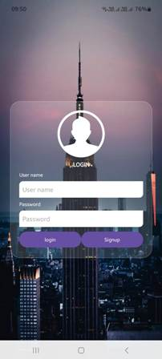

# Glass-morphism Example

## Overview

This project showcases the Glass-morphism design trend in Android development using Kotlin. It
demonstrates how to implement frosted glass UI elements that blur the background, providing a sleek
and modern aesthetic.

## Features

- Implementation of Glass-morphism using Kotlin and Android SDK.
- Customizable UI components with blur effects.
- Responsive layouts for various screen sizes.

## Getting Started

### Prerequisites

- Android Studio Arctic Fox or newer.
- Android SDK 30 or higher.

### Screenshots



### Installation

- Clone the repository:

```bash
   git clone https://github.com/anilkumar2681/glass-morphism_example.git
```

- Open the project in Android Studio.
- Build and run the application on an emulator or physical device.

### Uses

Explore the app/src/main/res/layout directory to find XML files demonstrating various Glass-morphism
components. Each layout showcases different blur effects and UI elements.

### Contributing

Contributions are welcome! Please fork the repository, create a new branch, and submit a pull
request with your proposed changes.

### License

This project is licensed under the MIT License.

### WhatsApp Channel
Get daily Kotlin and Jetpack Compose tips: [Join WhatsApp Channel] (https://whatsapp.com/channel/0029VbBGTNr90x2umLoWKU3z)
